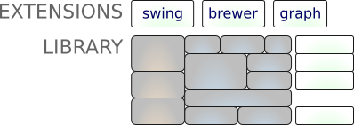

#  GeoTools学习笔记

## GeoTools Library

​	GeoTools 是一个开源的 Java GIS 工具包,可利用它来开发符合标准的地理信息系统。GeoTools 提供了 OGC(Open Geospatial Consortium)规范的一个实现来作为他们的开发。


Each layer of the “stack” is built on the ones below it:

- To use Referencing you need `gt-opengis`, `gt-referencing` and `gt-metadata`

- To use Data you need `gt-main`, `jts`, `gt-opengis`, `gt-referencing`, `gt-opengis`, `gt-metadata`

The maven tool can calculate the jars you need, please see the Eclipse or Netbeans quickstart for an example use.

| Module           | Purpose                                                      |
| :--------------- | :----------------------------------------------------------- |
| `gt-render`      | Implements of Java2D rendering engine to draw a map          |
| `gt-jdbc`        | Implements for accessing spatial database                    |
| `gt-main`        | Implements for accessing spatial data                        |
| `gt-xml`         | Implements of common spatial XML formats                     |
| `gt-cql`         | Implements of Common Query Language for filters              |
| `gt-main`        | Interfaces for working with spatial information. Implements filter, feature, etc… |
| `jts`            | Definition and implementation of Geometry                    |
| `gt-coverage`    | Implementation for accessing raster information              |
| `gt-referencing` | Implementation of co-ordinate location and transformation    |
| `gt-metadata`    | Implementation of identification and description             |
| `gt-opengis`     | Definition of interfaces for common spatial concepts         |

### GeoTools Plugins

GeoTools offers plug-ins to support additional data formats, different coordinate reference system authorities and so on.

| Module           | JAR                 | Plugin                           |
| :--------------- | :------------------ | :------------------------------- |
| `gt-render`      |                     |                                  |
| `gt-jdbc`        | `gt-jdbc-db2`       | Geometry in DB2                  |
|                  | `gt-jdbc-h2`        | Pure Java “H2” database          |
|                  | `gt-jdbc-mysql`     | Geometry in MySQL                |
|                  | `gt-jdbc-oracle`    | Oracle SDO Geometry              |
|                  | `gt-jdbc-postgis`   | PostgreSQL extension PostGIS     |
|                  | `gt-jdbc-sqlserver` | SQL Server                       |
|                  | `gt-jdbc-hana`      | SAP HANA                         |
|                  | `gt-jdbc-terasdata` | Teradata                         |
| `gt-main`        | `gt-shape`          | Shapefile read/write support     |
|                  | `gt-wfs`            | WFS read/write support           |
| `gt-xml`         |                     |                                  |
| `gt-cql`         |                     |                                  |
| `gt-main`        |                     |                                  |
| `jts`            |                     |                                  |
| `gt-coverage`    | `gt-geotiff`        | GeoTIFF raster format            |
|                  | `gt-arcgrid`        | arcgrid format                   |
|                  | `gt-mif`            | MIF format                       |
|                  | `gt-image`          | JPG, PNG, TIFF formats           |
| `gt-referencing` | `epsg-access` .     | Official EPSG database in Access |
|                  | `epsg-hsql`         | Pure Java port of EPSG database  |
|                  | `epsg-wkt`          | Lightweight copy of EPSG codes   |
|                  | `epsg-postgresql`   | PostgreSQL port of EPSG database |
|                  | `epsg-oracle`       | Oracle port of EPSG database     |
| `gt-metadata`    |                     |                                  |
| `gt-opengis`     |                     |                                  |

Usually at least one plug-in is needed for each layer for GeoTools to do something. As an example every time you use the referencing module please make sure you have an EPSG plugin around (or the referencing module will not know that “EPSG:4326” is the world as we know it).

## GeoTools Extensions

We have gone a bit further and implemented some interesting “extensions” on top of the GeoTools library. These extensions provide additional capabilities that are built on top of GeoTools using the spatial facilities of the library.



The extensions are independent of each other offering and may be of use in your application. Here is a brief listing of the extensions at the time of writing.

| JAR             | Extension                               |
| :-------------- | :-------------------------------------- |
| `gt-graph`      | Work with graph and network traversals  |
| `gt-validation` | Quality assurance for spatial data      |
| `gt-wms`        | Web Map Server client                   |
| `gt-xsd`        | Parsing/Encoding for common OGC schemas |
| `gt-brewer`     | Generation of styles using color brewer |

### XML

To support the XML module in GeoTools we have bundled up several XML schemas in JAR form (to prevent needing to download them from the Internet each time they are needed). In addition these jars contain a generated Java data structure produced with the Eclipse Modeling Framework.

| JAR               | Schema                        |
| :---------------- | :---------------------------- |
| `net.opengis.ows` | open web services schema      |
| `net.opengis.wfs` | web feature service           |
| `net.opengis.wps` | web processing service schema |
| `net.opengis.wcs` | web coverage service schema   |
| `net.opengis.wfs` | web feature service schema    |
| `org.w3.xlink`    | XLink schema                  |

These facilities are used by the XSD parser by way of a series of XSD plugins. These plugins indicating how to parse and encode additional content using Eclipse XSD library to parse XML schema documents and offer “bindings” showing how to parse and encode to Java classes such as String, Date, URL and Geometry.

| JAR             | Bindings                          |
| :-------------- | :-------------------------------- |
| `gt-xsd-core`   | Basic types defined by XML schema |
| `gt-xsd-fes`    | filter 2.0                        |
| `gt-xsd-filter` | filter (used by OGC CAT and WFS)  |
| `gt-xsd-kml`    | keyhole markup language           |
| `gt-xsd-wfs`    | web feature service               |
| `gt-xsd-wps`    | web processing service            |
| `gt-xsd-gml3`   | geographic markup language 3      |
| `gt-xsd-gml2`   | geographic markup language 2      |
| `gt-xsd-ows`    | open web services                 |
| `gt-xsd-wcs`    | web coverage service              |
| `gt-xsd-wms`    | web map service                   |
| `gt-xsd-sld`    | style layer descriptor            |

## GeoTools Unsupported

There are also a number of “unsupported” plugins and extensions. These modules are not distributed by the project management committee as part of the GeoTools download, however they are available via maven or individual download.

| Unsupported  | Purpose                                 |
| :----------- | :-------------------------------------- |
| `gt-swt`     | Standard widget toolkit interactive map |
| `gt-swing`   | Swing interactive map                   |
| `gt-oracle`  | retired oracle support                  |
| `gt-postgis` | retired PostGIS support                 |
| `gt-db2`     | retired db2 support                     |
| `gt-wps`     | Web Processing Service client           |
| `gt-process` | Job system for spatial data             |

## 环境配置要求

> 大于等于JDK8

## Maven资源库地址
```
  <repositories>
      <repository>
        <id>osgeo</id>
        <name>OSGeo Release Repository</name>
        <url>https://repo.osgeo.org/repository/release/</url>
        <snapshots><enabled>false</enabled></snapshots>
        <releases><enabled>true</enabled></releases>
      </repository>
      <repository>
        <id>osgeo-snapshot</id>
        <name>OSGeo Snapshot Repository</name>
        <url>https://repo.osgeo.org/repository/snapshot/</url>
        <snapshots><enabled>true</enabled></snapshots>
        <releases><enabled>false</enabled></releases>
      </repository>
    </repositories>
```

